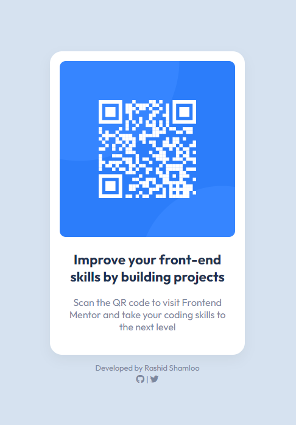

# Front End Mentor - Project 001 - QR Code Component

This is a solution to the [QR code component challenge on Frontend Mentor](https://www.frontendmentor.io/challenges/qr-code-component-iux_sIO_H).

## Table of contents

- [Overview](#overview)
  - [Screenshot](#screenshot)
  - [Links](#links)
- [My process](#my-process)
  - [Built with](#built-with)
  - [What I learned](#what-i-learned)
- [Author](#author)

## Overview

### Screenshot



### Links

- Solution URL: https://github.com/rashidshamloo/fem_001_qr-code-component/
- Live Site URL: https://rashidshamloo.github.io/fem_001_qr-code-component/

## My process

### Built with

- HTML5
- CSS

### What I learned

Using "min-height: 100%;" instead of "height: 100%;" on the body so it can grow vertically when there's more content.

```css
body {
  min-height: 100%;
  ...
}
```

## Author

- Frontend Mentor - [@rashidshamloo](https://www.frontendmentor.io/profile/rashidshamloo)
- Twitter - [@rashidshamloo](https://www.twitter.com/rashidshamloo)
